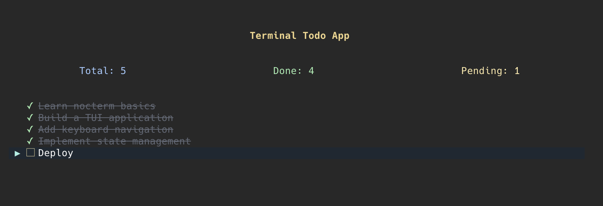

<p align="center">

</p>


[](https://pub.dev/packages/nocterm)
[](LICENSE)
[](https://dart.dev/platforms)

A powerful, Flutter-inspired Terminal User Interface framework with Riverpod state management for building beautiful command-line applications in Dart.



## ✨ Features

- **🎯 Flutter-like API** - Familiar component-based architecture that mirrors Flutter's design patterns
- **🔥 Hot Reload** - Instant UI updates during development for rapid iteration
- **🎨 Rich Styling** - Full color support, borders, padding, and text styling
- **⚡ Reactive State** - Riverpod integration plus built-in `StatefulComponent` and `setState()`
- **🐭 Mouse Support** - Full mouse interaction including wheel scrolling and click events
- **⌨️ Input Handling** - Comprehensive keyboard event system with focus management
- **📐 Flexible Layouts** - Row, Column, Stack, ConstrainedBox, and overlay-based layouts
- **📝 Rich Text** - Markdown rendering with formatted text, lists, and code blocks
- **🧪 Testing Framework** - Flutter-style testing utilities for TUI components
- **🌈 Cross-Platform** - Works seamlessly on Windows, macOS, and Linux

## 🚦 Project Status

> ⚠️ **Early Experimental Version (0.1.0)**
> 
> This framework is in active development. APIs may change significantly in future releases and breaking bugs are still present.

## 📦 Installation

Add `nocterm` to your `pubspec.yaml`:

```yaml
dependencies:
  nocterm: ^0.1.0
```


## 🏃 Quick Start

```dart
import 'package:nocterm/nocterm.dart';

void main() {
  runApp(const Counter());
}

class Counter extends StatefulComponent {
  const Counter({super.key});

  @override
  State<Counter> createState() => _CounterState();
}

class _CounterState extends State<Counter> {
  int _count = 0;

  @override
  Component build(BuildContext context) {
    return Focusable(
      focused: true,
      onKeyEvent: (event) {
        if (event.logicalKey == LogicalKey.space) {
          setState(() => _count++);
          return true;
        }
        return false;
      },
      child: Container(
        decoration: BoxDecoration(
          border: BoxBorder.all(color: Colors.gray),
        ),
        margin: EdgeInsets.all(8),
        child: Column(
          mainAxisAlignment: MainAxisAlignment.center,
          children: [
            Text('Counter: $_count'),
            SizedBox(height: 1),
            Text('Press SPACE to increment', style: TextStyle(color: Colors.gray)),
          ],
        ),
      ),
    );
  }
}

```

## 🔥 Hot Reload

Experience Flutter-like hot reload in your terminal applications:

```dart
// Run with hot reload enabled
// Your UI updates instantly as you save changes!
dart --enable-vm-service example/your_app.dart
```

## 🎨 Rich Components

### Layout
- ✅ **Basic** - Column, Row, Expanded, Container, Decoration
- ✅ **Advanced** - Stack, ConstrainedBox, Overlay system
- ✅ **Scrollable** - ListView, ScrollView with mouse wheel support
- ✅ **Positioning** - Align, Center, Padding, Margin

### Input & Interaction
- ✅ **TextField** - Multi-line input with enhanced cursor styles
- ✅ **Focusable** - Keyboard event handling and focus management
- ✅ **Mouse Support** - Click and wheel events

### Display
- ✅ **Text** - Rich text, markdown rendering, text wrapping
- ✅ **Progress** - Progress bars and indicators
- ✅ **Divider** - Horizontal and vertical dividers
- ✅ **Terminal** - xTerm embedding for subprocess integration

### State Management
- ✅ **Riverpod** - Full reactive state management
- ✅ **StatefulComponent** - Built-in setState pattern


## 🧪 Testing

Write tests for your TUI components:

```dart
import 'package:test/test.dart';
import 'package:nocterm/nocterm.dart';

void main() {
  test('component renders correctly', () async {
    await testNocterm(
      'my component test',
      (tester) async {
        await tester.pumpComponent(
          Text('Hello, TUI!', style: TextStyle(color: Colors.green))
        );
        
        expect(tester.terminalState, containsText('Hello, TUI!'));
        expect(tester.terminalState, hasStyledText(
          'Hello, TUI!',
          style: TextStyle(color: Colors.green),
        ));
      },
      debugPrintAfterPump: true, // See visual output during testing
    );
  });

  test('handles keyboard input', () async {
    await testTui(
      'keyboard test',
      (tester) async {
        await tester.pumpComponent(MyInteractiveComponent());
        await tester.sendKey(LogicalKey.enter);
        
        expect(tester.terminalState, containsText('Enter pressed!'));
      },
    );
  });
}
```
## 📝 License

This project is licensed under the MIT License - see the [LICENSE](LICENSE) file for details.

## 🙏 Acknowledgments

- Inspired by [Flutter](https://flutter.dev) and [Jaspr](https://github.com/schultek/jaspr)

---

<div align="center">
  Made with 💙
</div>
